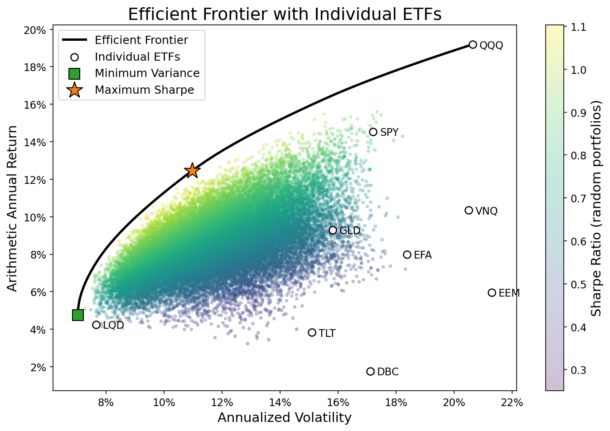
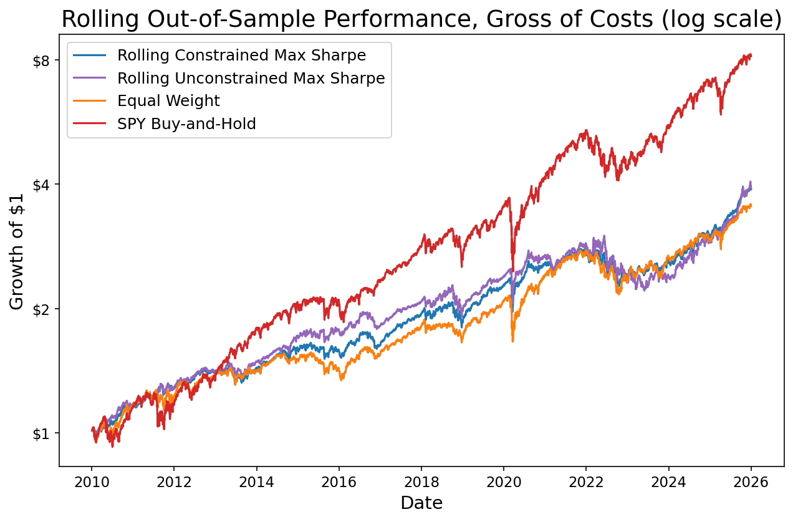

# Multi-Asset Portfolio Optimization and Robustness Analysis

## Overview

This project examines portfolio construction across a diversified ETF universe using mean-variance optimization, allocation constraints, rolling out-of-sample testing, and bootstrap resampling.

The objective is not only to identify portfolios with attractive historical risk-return characteristics, but also to test how sensitive optimized allocations are to estimation error and changing market conditions.

## Asset Universe

The analysis uses nine ETFs representing multiple asset classes:

- SPY: U.S. equities
- QQQ: U.S. technology / growth
- EFA: Developed international equities
- EEM: Emerging-market equities
- TLT: Long-term U.S. Treasuries
- LQD: Investment-grade corporate bonds
- GLD: Gold
- VNQ: Real estate
- DBC: Broad commodities

The main analysis uses daily adjusted prices from January 2010 through December 2025. Prices from 2008–2009 are used only for the first two-year estimation window of the rolling backtest.

## Methodology

The notebook includes:

- Historical return, volatility, and correlation analysis
- Equal-weight portfolio benchmarking
- Long-only minimum-variance and maximum-Sharpe optimization, with and without 5%–35% allocation bounds
- Efficient frontiers that run from the minimum-variance return to the maximum feasible return under each set of bounds
- 30,000 random portfolios drawn uniformly from all long-only, fully invested allocations
- In-sample performance evaluation using CAGR, volatility, Sharpe ratio, and maximum drawdown
- A rolling out-of-sample backtest of constrained and unconstrained maximum-Sharpe strategies (two-year estimation window, rebalancing every 21 trading days)
- Transaction-cost sensitivity at 10 and 25 basis points per dollar traded
- Bootstrap resampling of the full sample (300 resamples) to evaluate how sensitive portfolio weights are to estimation error

### Conventions

- **Units:** Estimation and backtesting use daily returns. Results are reported in annual terms.
- **Arithmetic annual return** = mean daily return × 252. This is the optimizer's expected-return input. **CAGR** is the realized compound annual growth rate.
- **Sharpe ratio** = √252 × mean daily excess return / standard deviation of daily excess return, with the risk-free rate assumed to be zero.
- **Backtest information:** At each rebalance, weights are estimated from the previous 504 daily returns, ending with the return to the most recent close. No later data are used.
- **Backtest execution (idealized):** Trades are assumed to execute at that same closing price, so new weights first earn the following day's return. This treats computing the weights and trading as instantaneous at the close. Any real-world delay between observing the close and trading is not modeled.
- **Backtest holdings:** Portfolios are rebalanced to target weights every 21 trading days and drift with returns in between.
  - The 5%–35% bounds apply to the target weights at each rebalance. Actual weights drift between rebalances and ranged from 3.8% to 40.7% for the constrained strategy.
  - The equal-weight benchmark follows the same schedule, and SPY is buy-and-hold.
- **Turnover** is one-way: ½ × Σ |target weight − drifted weight| at each rebalance, excluding the initial purchase.
- **Transaction costs:** These are charged on purchases and sales.
  - The cost of a rebalance is the cost rate × Σ |target − drifted|, which equals 2 × cost rate × one-way turnover.
  - It is deducted from portfolio value at the rebalance, before the next day's return.
  - Every strategy, including SPY, pays for its initial purchase from cash.
  - Costs are computed on the pre-trade portfolio value. The second-order effect of paying the cost on the amount traded is ignored; it is below 0.001% of portfolio value per rebalance at 25 bps.
- **Optimizer checks:** Every optimization must report success and return feasible weights. In the backtest, a failed rebalance keeps the current holdings. No failures occurred in this run.

## Key Results



**In sample**

- Unconstrained maximum-Sharpe optimization concentrates in QQQ (44%), GLD (28%), and TLT (25%), with an estimated Sharpe ratio of 1.14.
- The 5%–35% bounds reduce the estimated Sharpe ratio to 1.00 while spreading the allocation across all nine ETFs.

**Rolling out-of-sample backtest, gross of costs** (January 2010 – December 2025, same dates for all strategies)

| Strategy | CAGR | Volatility | Sharpe | Max drawdown | Annual turnover |
|---|---|---|---|---|---|
| Rolling max Sharpe, 5%–35% bounds | 8.87% | 9.93% | 0.91 | −19.19% | 111% |
| Rolling max Sharpe, unconstrained | 8.93% | 11.18% | 0.82 | −26.41% | 176% |
| Equal weight (21-day rebalance) | 8.23% | 11.13% | 0.77 | −22.78% | 16% |
| SPY buy-and-hold | 14.05% | 17.21% | 0.85 | −33.72% | — |



- Before costs, the constrained strategy had the highest Sharpe ratio, the lowest volatility, and the shallowest drawdown of the four. It also traded about 37% less than the unconstrained strategy.
- Both optimized strategies had lower Sharpe ratios out of sample than in sample. The drop was larger without bounds (1.14 → 0.82) than with them (1.00 → 0.91).
- SPY produced by far the highest CAGR, with substantially higher volatility and the deepest drawdown.

**After transaction costs** (per dollar traded; values shown as gross / 10 bps / 25 bps)

| Strategy | CAGR | Sharpe | Max drawdown |
|---|---|---|---|
| Rolling max Sharpe, 5%–35% bounds | 8.87% / 8.62% / 8.25% | 0.91 / 0.88 / 0.85 | −19.19% / −19.39% / −19.69% |
| Rolling max Sharpe, unconstrained | 8.93% / 8.54% / 7.95% | 0.82 / 0.79 / 0.74 | −26.41% / −26.59% / −26.86% |
| Equal weight (21-day rebalance) | 8.23% / 8.19% / 8.13% | 0.77 / 0.76 / 0.76 | −22.78% / −22.79% / −22.81% |
| SPY buy-and-hold | 14.05% / 14.04% / 14.03% | 0.85 / 0.85 / 0.85 | −33.72% / −33.72% / −33.72% |

- Costs reduce returns roughly in proportion to turnover.
- At 25 bps, the constrained strategy's Sharpe ratio (0.85) is approximately equal to SPY at the reported two-decimal precision.
- The unconstrained strategy, which trades the most, falls to 0.74, below equal weight. Its gap to the constrained strategy widens as costs rise.
- The constrained strategy keeps the shallowest drawdown at every cost level.

**Bootstrap**

Resampling the full 2010–2025 sample showed that optimized weights are highly sensitive to estimation error. The bounds narrowed weight variability for every ETF that varied, partly by construction, because constrained solutions cannot leave the 5%–35% range. This is a sensitivity analysis on the whole historical dataset, not an out-of-sample test.

All results are historical point estimates from a single 16-year path, with a zero risk-free rate. No significance tests were performed, so statistical superiority of any strategy has not been established.

## Running the Notebook

Tested with Python 3.13.

```bash
python -m venv .venv
.venv\Scripts\activate          # Windows; use `source .venv/bin/activate` on macOS/Linux
pip install -r requirements.txt
jupyter nbconvert --to notebook --execute --inplace portfolio_analysis.ipynb
```

The last command re-runs the whole notebook from a clean kernel. It takes about two minutes. To work interactively, open the notebook in VS Code or install JupyterLab (`pip install jupyterlab`).

The notebook also writes the two README charts to `images/`.

On Windows, clone into a reasonably short folder path. Otherwise, `pip install` can fail on Windows' 260-character path limit unless long-path support is enabled.

## Data

- **Cached prices:** `data/prices.csv` holds daily adjusted closes (split- and distribution-adjusted) from Yahoo Finance, January 2008 – December 2025, in the ticker order above.
- **Metadata:** `data/prices_metadata.json` records the source, dates, download settings, and retrieval time.
- **How this cache was built:** It was retrieved directly from Yahoo's chart API, because yfinance requests were rate-limited at build time. It is the same adjusted-close series that `yf.download(..., auto_adjust=True)["Close"]` returns.
- **Refreshing:** The notebook reads the cache by default. Set `REFRESH_DATA = True` in the configuration cell to re-download with yfinance and overwrite the cache and metadata. Yahoo revises adjusted history after each distribution, so a refresh can shift results slightly.
- **Validation:** Before using the cache, the notebook checks that the metadata file exists and matches the configured date range, that dates are sorted and unique, and that all nine tickers have data. If any check fails, it stops with an explanatory error.

## Repository Structure

- `portfolio_analysis.ipynb` - Full analysis, optimization, backtesting, visualizations, and conclusions
- `data/prices.csv`, `data/prices_metadata.json` - Cached price data and its provenance
- `images/` - Charts used in this README, generated by the notebook
- `requirements.txt` - Python package versions used for the results above
- `README.md` - Project overview and key findings

## Tools

Python libraries used:

- NumPy
- pandas
- SciPy
- Matplotlib
- Seaborn
- yfinance

## Limitations

- **Risk-free rate:** Sharpe ratios assume a zero risk-free rate.
- **Costs:** Transaction costs are modeled only as a flat proportional charge per dollar traded. Market impact, time-varying spreads, and taxes are not included.
- **Execution:** Trades are assumed to execute instantly at the closing price used for estimation.
- **Estimates:** The rolling strategies rely on historical estimates of expected returns and covariance.
- **Bootstrap:** Samples are drawn independently from daily historical returns and therefore do not preserve serial dependence.

Potential extensions include execution-lag and richer transaction-cost models, a nonzero risk-free rate, covariance shrinkage, alternative expected-return models, and block bootstrap methods.

## Disclaimer

This project is for educational and research purposes only and does not constitute investment advice.
